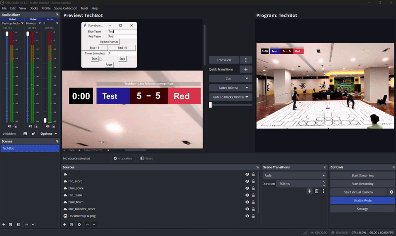
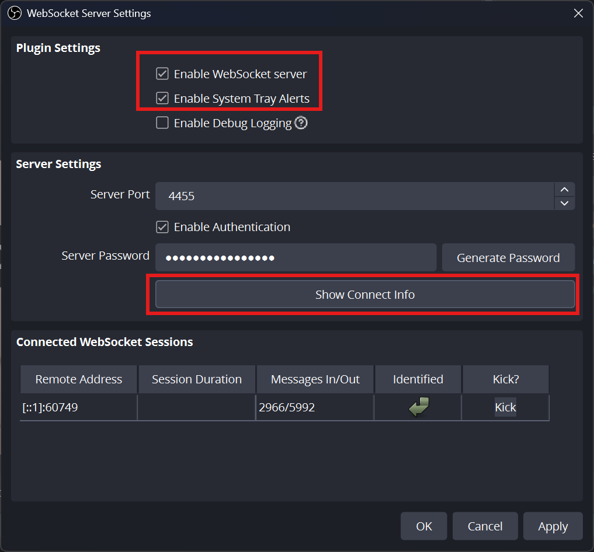
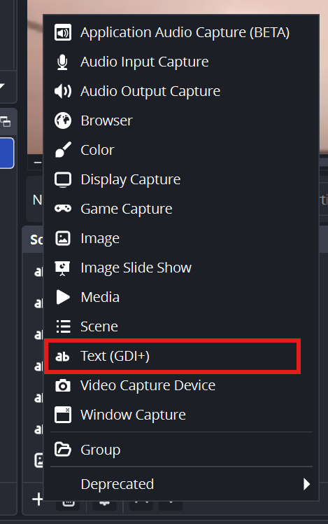

# OBS Scoreboard Controller



This is a Python Tkinter dashboard that allows you to control a live scoreboard in OBS Studio. It includes:

- Countdown timer with minute input
- Blue/Red score buttons (+5 per click) - just for sample
- Editable team names
- Real-time update to OBS Text Sources

---

## 🔧 My setup:

1. OBS Studio 32.1.0
2. Python 3.10

3. Host machine: Windows 11


---

## ⚙ OBS Setup

1. Open OBS Studio.  
2. Enable **obs-websocket** server:
- Go to `Tools → obs-websocket Settings`
- Set **Port:** `4455`
- Set **Password:** `**********` (Base on your software)
- Make sure server is enabled.  



3. In source, add Text(GDI) and name it as (base on the preferences):

- `blue_score`
- `red_score`
- `blue_team`
- `red_team`
- `line_follower_timer`



3. Add the following **Text Sources** to your scene. Names must match exactly:
- `blue_score`
- `red_score`
- `blue_team`
- `red_team`
- `line_follower_timer`

---

## 💻 Python Setup

1. Save the Python code as [data_sending.py](data_sending.py).  
2. Make sure Python environment has `obs-websocket-py` installed.  

```
pip install obs-websocket-py
```

3. Run the dashboard:

```
python data_sending.py
```


---

## 🖥 Using the Dashboard

1. **Team Names**: Enter team names in the input boxes and click `Update Names`.  
2. **Scores**: Click `Blue +5` or `Red +5` to increase the score by 5 points.  
3. **Timer**:
- Enter minutes in the timer box (e.g., 3 for 3 minutes).  
- Click `Start` to begin countdown.  
- Click `Stop` to pause.  
- Click `Reset` to reset scores and timer.  
4. OBS text sources will update automatically in real-time.

---

## ⚠️ Notes

- Make sure OBS is running and WebSocket server is enabled before running Python.  
- Source names in OBS must match the names in the Python code exactly.  
- Timer format is `M:SS`, e.g., `3:00`.  

---

## 🚀 Optional Improvements

- Add buzzer sound when timer ends.  
- Flash last 10 seconds in OBS.  
- Keyboard shortcuts for score increments.  
- Custom styled esports overlay in OBS.